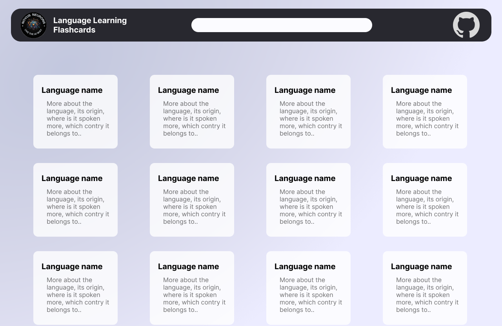

# Langhub

Welcome to the Language Learning Flashcards project! This open-source web application aims to promote the learning of different languages by providing a collection of flashcards containing sentences and words from various languages.



## Project Overview

- **Project Objective:** To create a platform that helps users learn different languages through flashcards.
- **Available Languages:** We provide flashcards for a wide range of languages, including regional Indian languages and foreign languages.
- **Contribution:** This project is open to contributions from the community. Whether you are a language enthusiast, linguist, or developer, you can contribute to the project by adding new flashcards, translations, and language-specific content.

## Features

- **Language Flashcards:** Each language has its own dedicated page with a collection of flashcards. These flashcards contain sentences and words from that language.
- **Details and Translations:** Clicking on a word or sentence will reveal its details, pronunciation, and translations, making it easier for users to learn and understand.
- **Open Source:** This project is open source, which means anyone can contribute to it. Feel free to add new content, improve existing content, or help with development.

## Getting Started

Follow these steps to get started with the Langhub:

1. **Clone the Repository:** Clone this GitHub repository to your local machine.

```bash
git clone https://github.com/Novus-Neurons/langhub.git
```

<hr />